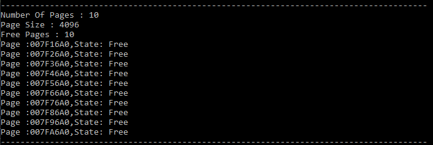
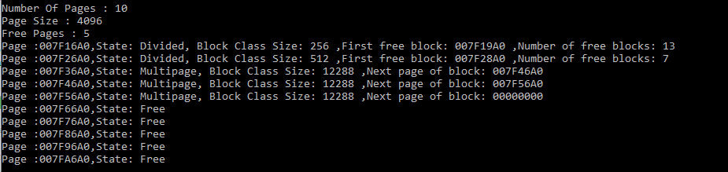
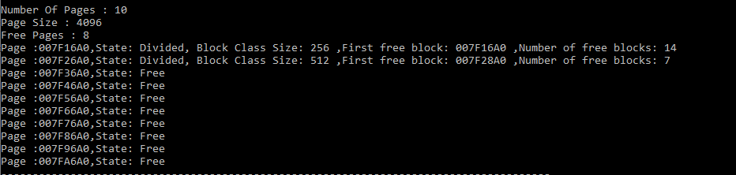
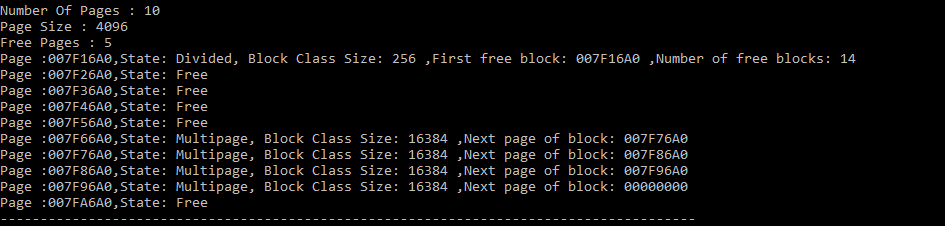

# OS Lab 2 - Page Allocator


## Main part


Вся виртуальная память состоит из страниц. Каждая страница может находиться в оперативной памяти или во внешнем файле (рассматриваются страницы, к которым было хотя бы одно обращение, т.е. страницы для которых были выделены ресурсы виртуальной памяти). При обращении к странице, которая находится во внешнем файле, происходит страничный промах и операционная система находит свободную физическую страницу и считывает в неё содержимое из внешнего файла. Размер страницы обычно равен от 4 Кбайт до нескольких Мбайт. Таким образом, если в процессе принятия решения аллокатор памяти обращается к меньшему числу страниц, тем меньше он оставляет след в памяти, тем он эффективнее.
### Константи
**PageSize**-минимальный размар страницы(4096)
**MinBlockSizе**-минимальный размер блока(16)

### Состояния страниц

**Free**-страница на данный момент свободна

**Divided**-страница была разделена на блоки одного класса.Блоки одного класса имеют одинаковый размер.Например, этот размер может быть число 2 x (x ? 4).

**Multipage**-блоки размером в одну или несколько страниц. Если приложение запрашивает блок памяти некоторого размера большего чем половина страницы, то аллокатор округляет этот размер до ближайшего целого числа страниц.


#### Функция аллокации

```
#void * mem_alloc (size_t size)#
```

Функция выделяет блок памяти заданного размера в size байт. Если блок памяти был выделен успешно, то возвращает адрес начала этого блока, в противном случае возвращает NULL.

### Функция реаллокации

```
void * mem_realloc (void * addr, size_t size)
```

Функция изменяет размер блока памяти с адресом addr до size байт. При этом содержимое (всё или часть) старого блока памяти переносится в другой блок памяти.


### Free memory function
```
void mem_free (void * addr)
```

Функция освобождает прежде выделенный блок памяти.

## Демонстрация

### Создание аллокатора
#### Мы создали аллокатор с 10 страницами

##### Код
```
PageAllocator aloc = PageAllocator(10*PageSize);
aloc.mem_dump();
```
##### Результат


На данный момент все 10 страничек свободны

### Выделение блоков памяти заданого размера
#### Мы выделил 3 блока по 200 байт, 1 блок 300 байт и 1 большой блок на 3 страницы

##### Код
```
void* a1 =aloc.mem_alloc(200);
	void* a2 = aloc.mem_alloc(300);
	void* a3 = aloc.mem_alloc(200);
	void* a4 = aloc.mem_alloc(200);
	void* a5 = aloc.mem_alloc(3*PageSize);
	aloc.mem_dump();
```

##### Результат


Пример аллоцирования блоков

### Освобождение прежде выделенных блоков
#### Мы освобождаем 1 блок на 200 байт и 1 блок на 3 страницы

##### Код
```
aloc.mem_free(a1);
	aloc.mem_free(a5);
	aloc.mem_dump();
```
Пример освобождения блоков
##### Результат

---
### Изменение размера блока
#### Мы изменили размер блока с 300 байт до размара 4 страниц
##### Код
```
void* a6 = aloc.mem_realloc(a2,4*PageSize);
	aloc.mem_dump();
```

##### Результат

---

